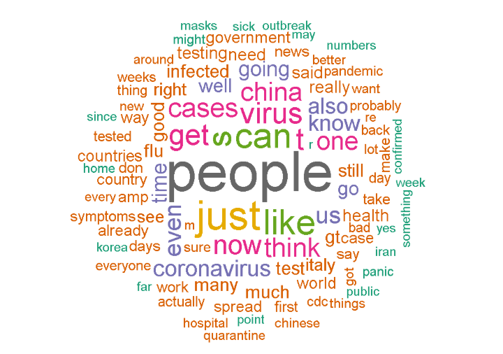
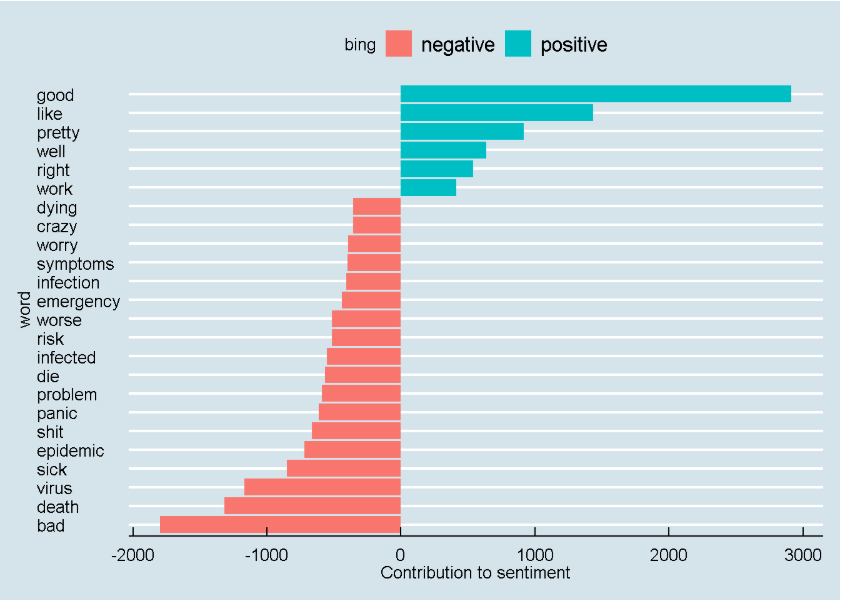
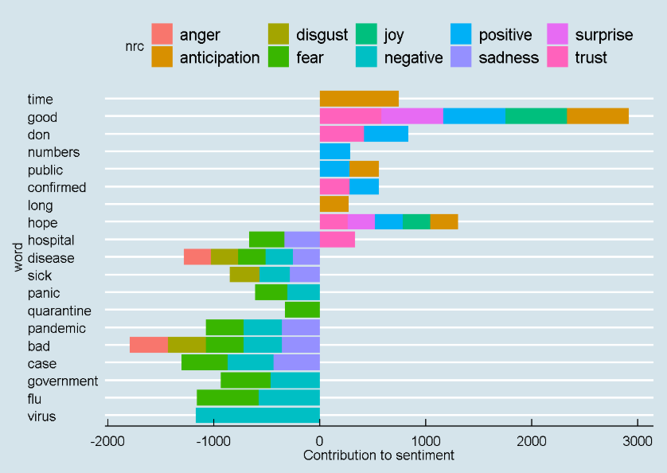
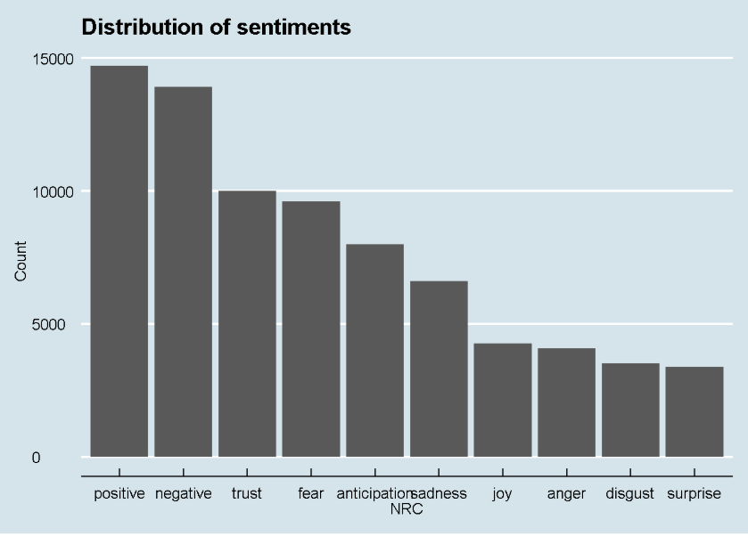
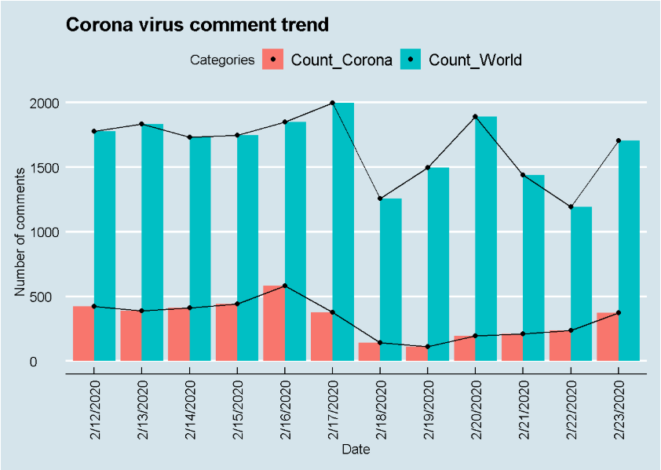
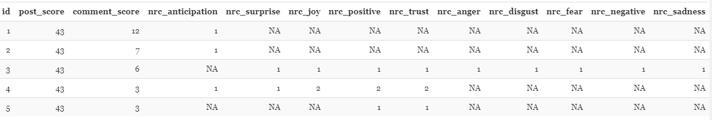
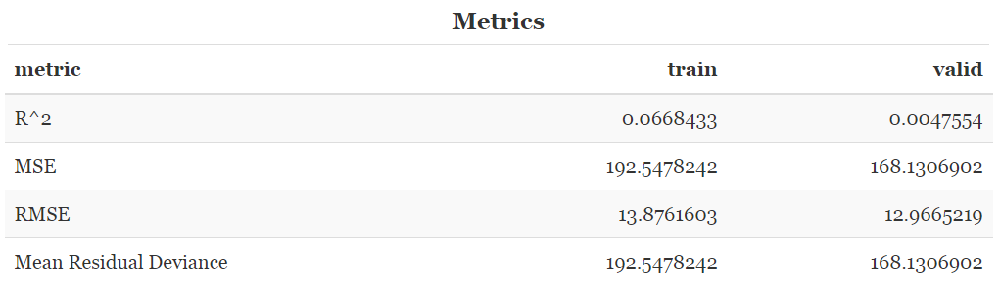
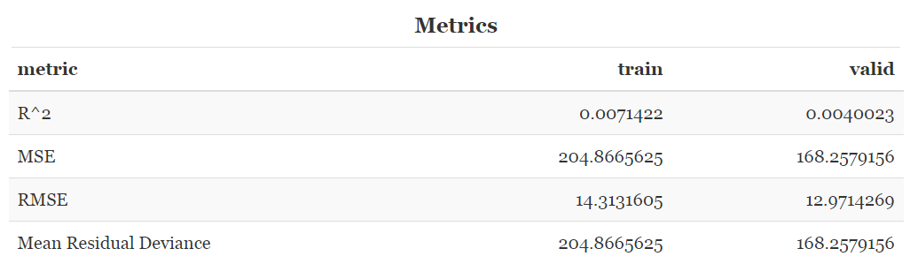

```{r setup, include=FALSE}
knitr::opts_chunk$set(echo = TRUE)
```

## **Data Analytics Plan**

We used https://www.reddit.com/ for the sentiment analysis of the recent Corona Virus outbreak. The idea behind it is to analyse Reddit community's reaction to this outbreak by tracking the comments in Corona and World News subreddits.

Attributes used:
*Comments*, *Comments Score* and *Post Score*

## **Peer Comments Summary**

- Inclusion of Deep learning models and machine learning techniques
- To implement clustering in the analysis
- Use PCA to reduce the number of features for faster computation
- Use predefined sentiment lexicons like bing, nrc in tidytext package
- To handle grammatical nuances, misspellings, and ambiguity during analysis

## **Word Cloud Visualization**

```{r, out.width = "750px", echo=FALSE}

```

## **Sentiment Visualization using bing**

```{r, out.width = "750px", echo=FALSE}

```

## **Sentiment Visualization using nrc**
```{r, out.width = "750px", echo=FALSE}

```

## **Sentiment Distribution**

```{r, out.width = "750px", echo=FALSE}

```

## **Corona Virus Comment Trend**

```{r, out.width = "750px", echo=FALSE}

```

## **Sentiment output to ML**

```{r, out.width = "1000px", echo=FALSE}

```

## **ML Model Procedures**

We used two models using H2o instances that can predict a comment’s score based on the score of the parent post and the NRC sentiments of the comments:

* *Gradient Boosting Model*
* *Linear Regression Model*

After processing data was divided:

* Train (70%)
* Test (15%)
* Validate (15%)

## **Gradient Boosting Model Results**

```{r, out.width = "1000px", echo=FALSE}

```


## **Linear Regression Model Results**

```{r, out.width = "1000px", echo=FALSE}

```

## **Key Take-aways**

* ML metrics can change significantly in a day after getting fresh data
  * RMSE 3 vs 15
* Further spread of the Corona virus --> wordcloud changes
* Since no cure for Coronavirus yet, people are having more negative sentiments than positive ones --> evident from bing visualization
